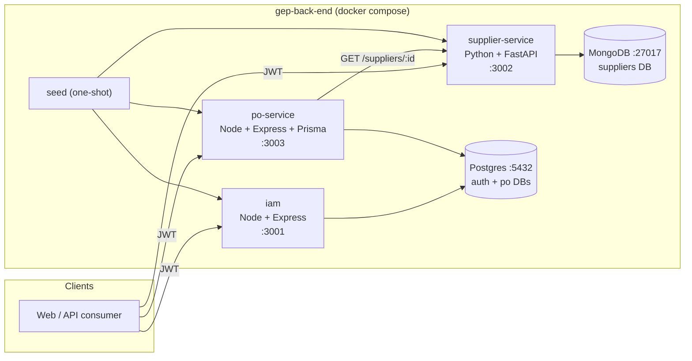

# System Architecture

## Service topology

## How the pieces fit

- **`iam`** is the only **token issuer**. The other two services are **token consumers** — they validate the HS256 signature with the shared `JWT_SECRET` and trust the embedded `sub`, `roles`, and `approval_limit` claims.
- **`po-service` → `supplier-service`** is the only cross-service synchronous call: when creating a PO, `po-service` calls `GET /api/v1/suppliers/{id}` to verify the supplier exists and is `ACTIVE`.
- **Postgres** hosts two logical databases (`auth`, `po`) inside a single instance, so `iam` and `po-service` share infra but not schema.
- **`seed`** is a one-shot container that runs after all three services are healthy, calling each service's HTTP API to insert demo users, suppliers, and POs.

## Why this shape

- Each service owns its **data store** and its **bounded context** — no cross-service joins, no shared tables.
- A **shared JWT secret** trades RS256/JWKS complexity for fewer moving parts at v1 scale; the cost (rotation requires a coordinated restart) is acceptable.
- Two languages (Node, Python) on purpose: the spec calls out a deliberately mixed stack to exercise cross-stack patterns (auth, error model, OpenAPI).
