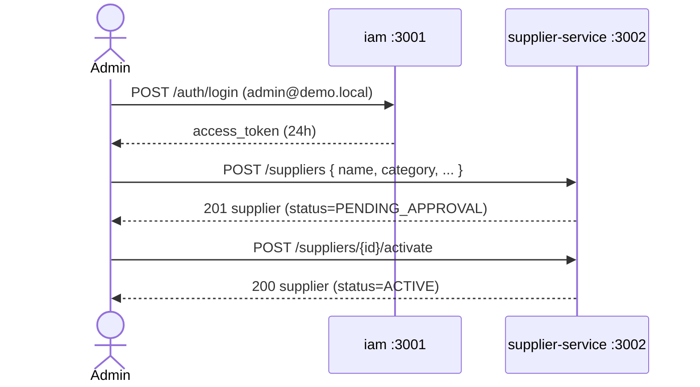
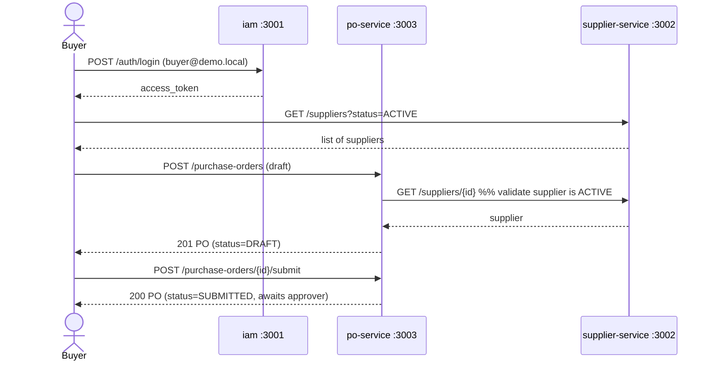
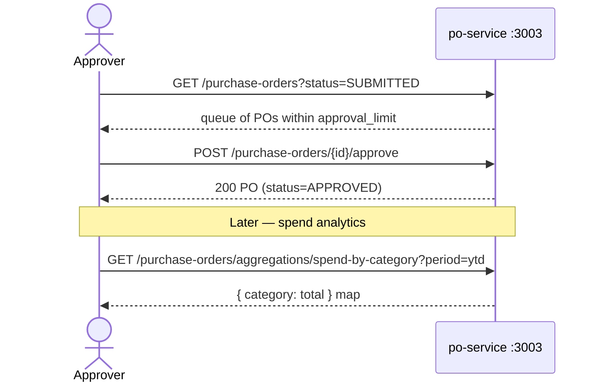

# User Journeys

Three end-to-end journeys exercise every service in the platform.

## 1. Supplier onboarding (Admin)

## 2. Create & submit a purchase order (Buyer)

## 3. Approve a PO and view spend (Approver / Admin)

A PO whose total exceeds the approver's `approval_limit` cannot be approved by them (403); routing is based on the threshold configured per user in `iam`.
