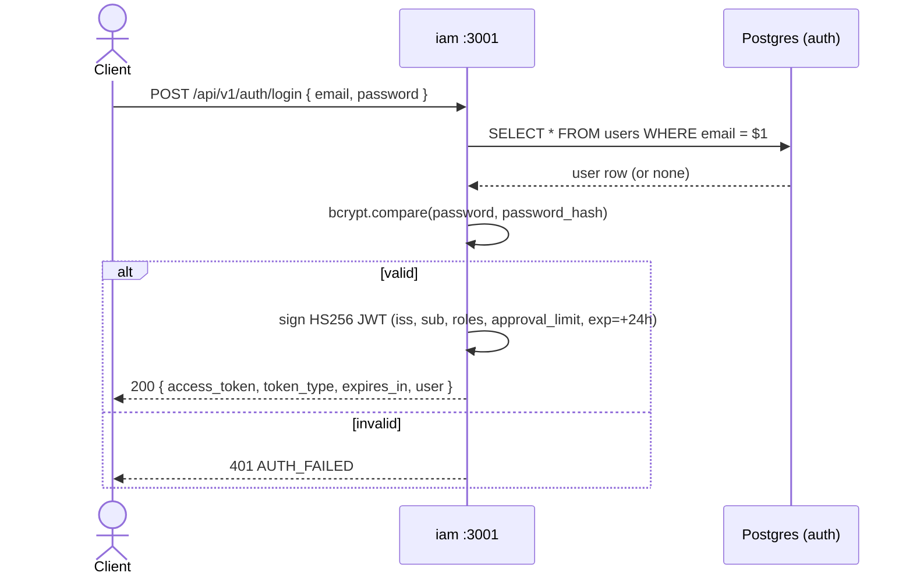
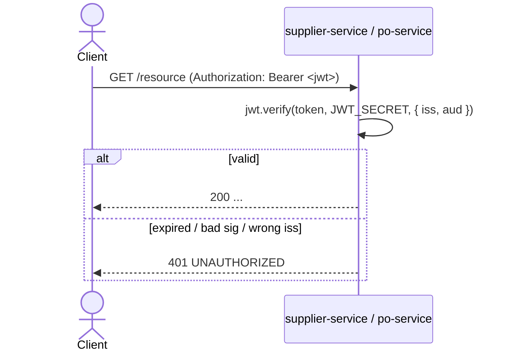

# IAM — Authentication Flow

## Login → token issuance



## Subsequent calls (token validation by downstream services)



The downstream services trust the JWT's claims (`roles`, `approval_limit`) directly — they do **not** call back to `iam` to re-fetch the user.

## Claim shape

```json
{
  "iss": "gep-auth",
  "sub": "<user uuid>",
  "email": "buyer@demo.local",
  "roles": ["BUYER"],
  "approval_limit": null,
  "iat": 1700000000,
  "exp": 1700086400
}
```

`aud` is set per-consumer (`gep-supplier`, `gep-po`) — see `docker-compose.yml`.
