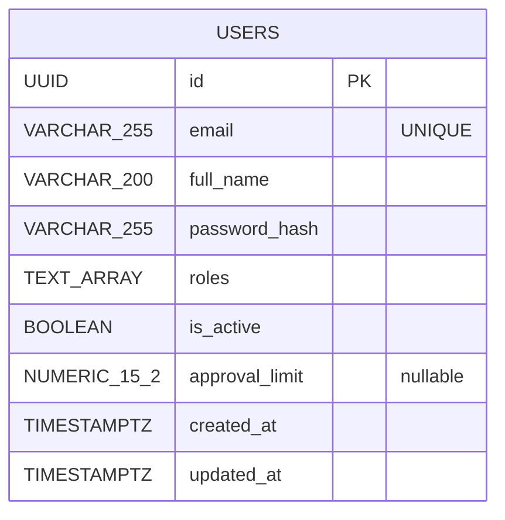

# IAM — Data Model

Source: `iam/migrations/001_init.sql`

## Notes

- **One table only.** Roles are an array of strings, not a join table — v1 has no per-role attributes.
- `password_hash` is **bcrypt** (cost 10).
- `approval_limit` is nullable: only meaningful for users with the `APPROVER` role.
- `idx_users_email` supports the login lookup by email.
- UUIDs generated via `pgcrypto` (`gen_random_uuid()`).
