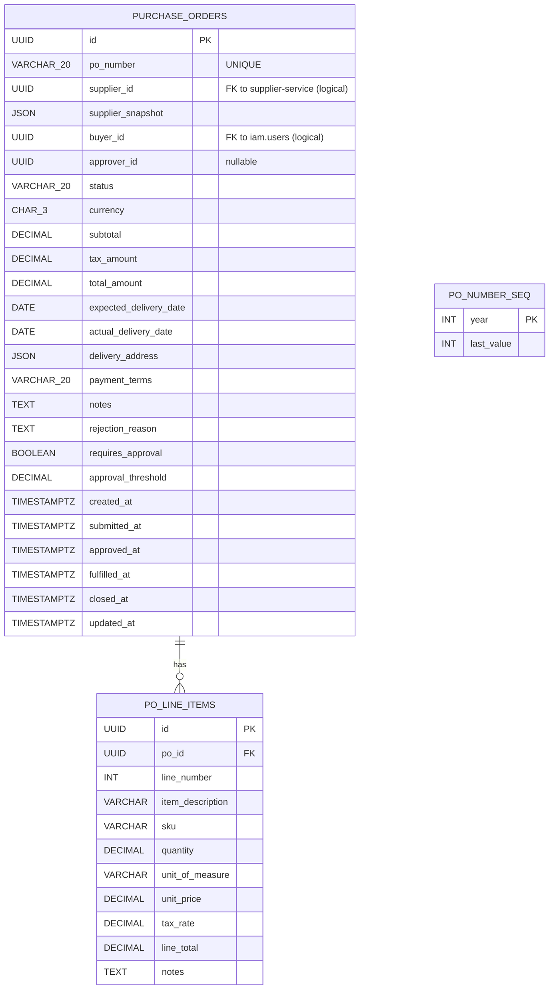

# PO — Data Model

Source: `po-service/prisma/schema.prisma`

## Notes

- **Foreign keys to other services are logical only** — `supplier_id` (Mongo) and `buyer_id` / `approver_id` (Postgres in `auth` DB) are not enforced by Postgres. Integrity comes from validation at write time.
- **`supplier_snapshot`** freezes the supplier's identifying fields at submission, so renaming a supplier later doesn't change historical PO text.
- **Indexes** — `status`, `supplier_id`, `buyer_id`, `created_at`. Tuned for the dashboard "my POs" and "approvals queue" views.
- **`PoNumberSeq`** — one row per year, used by an upsert-with-increment to mint `PO-YYYY-NNNNNN` numbers safely.
- **Cascade delete** — deleting a `PurchaseOrder` cascades to its line items (`onDelete: Cascade`). v1 only soft-uses this for test cleanup.

## Generating the ER diagram from Prisma

For an always-up-to-date ER, add `prisma-erd-generator` to the schema as a `generator` block; output can be embedded back into this page via the snippet extension. Out of scope for the initial doc-gen pass.
