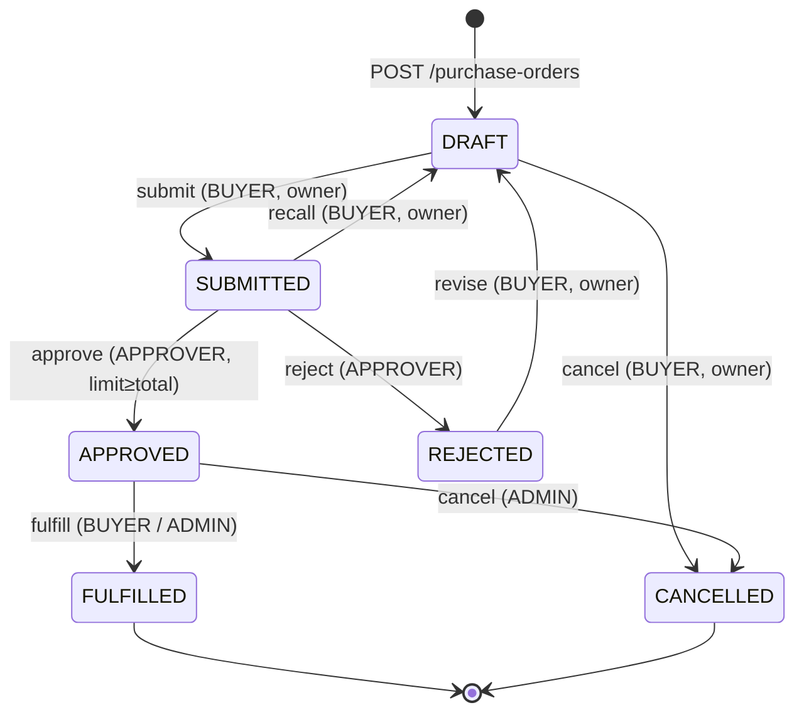

# PO Lifecycle

## Key rules

- **Supplier must be `ACTIVE`** at the moment of `DRAFT → SUBMITTED`. `po-service` calls `supplier-service` to check; otherwise → `409 SUPPLIER_NOT_ACTIVE`.
- **Approval routing** — when `total_amount > DEFAULT_APPROVAL_THRESHOLD` (or any supplier-level override), `requires_approval = true` is set at submission. Otherwise the PO is auto-approved on submit.
- **Approver limit** — `approve` returns `403 APPROVAL_LIMIT_EXCEEDED` if the caller's `approval_limit` is less than the PO total.
- **Supplier snapshot** — `supplier_snapshot` (JSON) captures the supplier's key fields at submission time so later supplier edits don't mutate historical POs.
- **Timestamps** — `submitted_at`, `approved_at`, `fulfilled_at`, `closed_at` are stamped on the matching transitions.

## Status values

`DRAFT`, `SUBMITTED`, `APPROVED`, `REJECTED`, `FULFILLED`, `CANCELLED`.
