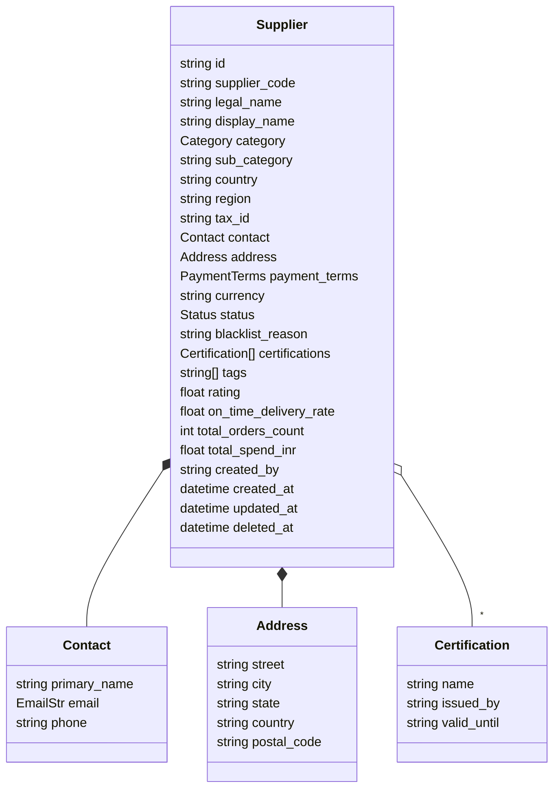

# Supplier — Data Model

Source: `supplier-service/app/models.py`. MongoDB collection: `suppliers` (database: `suppliers`).

## Enums

- **`Category`** — `RAW_MATERIALS`, `PACKAGING`, `LOGISTICS`, `IT_SERVICES`, `PROFESSIONAL_SERVICES`, `MRO`, `CAPEX`, `OTHER`.
- **`PaymentTerms`** — `NET_15`, `NET_30`, `NET_45`, `NET_60`, `NET_90`, `IMMEDIATE`, `ADVANCE_50_50`.
- **`Status`** — `PENDING_APPROVAL`, `ACTIVE`, `INACTIVE`, `BLACKLISTED`.

## Notes

- `supplier_code` is the human-readable unique key; `id` is a UUID string.
- `deleted_at` provides soft-delete; read endpoints filter it out unless explicitly requested.
- KPI fields (`rating`, `on_time_delivery_rate`, `total_orders_count`, `total_spend_inr`) are denormalised here for fast list views; they are updated by background jobs / explicit endpoints, not by `po-service`.
