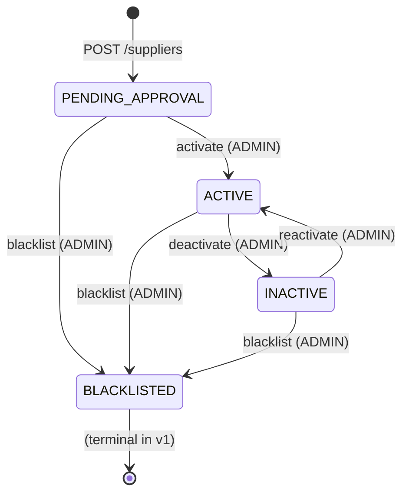

# Supplier — Status Lifecycle

Source: `supplier-service/app/state_machine.py`

## Transition table

| From | To | Required role |
|---|---|---|
| `PENDING_APPROVAL` | `ACTIVE` | ADMIN |
| `PENDING_APPROVAL` | `BLACKLISTED` | ADMIN |
| `ACTIVE` | `INACTIVE` | ADMIN |
| `ACTIVE` | `BLACKLISTED` | ADMIN |
| `INACTIVE` | `ACTIVE` | ADMIN |
| `INACTIVE` | `BLACKLISTED` | ADMIN |

Any other (from, to) pair yields `409 INVALID_STATUS_TRANSITION` with `{ "from": ..., "to": ... }` in `error.details`.

## Endpoints driving transitions

- `POST /suppliers/{id}/activate`
- `POST /suppliers/{id}/deactivate`
- `POST /suppliers/{id}/blacklist` (requires `{ "reason": "..." }`)
- `POST /suppliers/{id}/reactivate`

The full request/response shapes are in the [API Reference](api.md).
